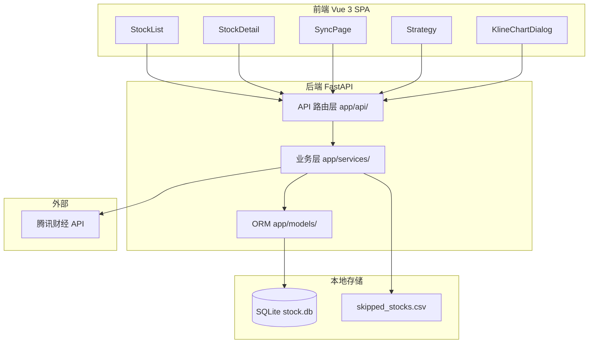
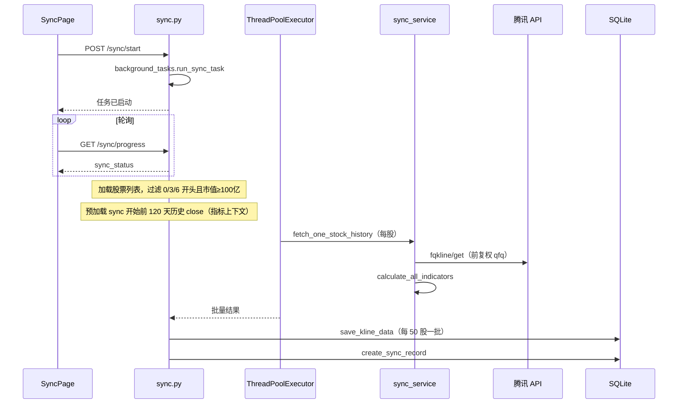

# Stock Selection System — 项目上下文文档

> **用途**：供开发者与 AI 助手快速理解仓库全貌，作为持久上下文参与后续开发。  
> **最后更新**：2026-06-19  
> **相关文档**：[`README.md`](../../README.md)（快速上手）、[`PROJECT.md`](../../PROJECT.md)（历史方案文档，部分内容已过时）

---

## 1. 项目概览

| 维度 | 说明 |
|------|------|
| **定位** | 面向个人投资者的 A 股数据同步与技术分析平台 |
| **部署模式** | **单机、单用户** — 无认证、无多租户、无分布式 |
| **核心能力** | 腾讯财经 API 同步 K 线（前复权）、技术指标计算、ECharts K 线图、选股策略筛选 |
| **后端入口** | `http://127.0.0.1:8001`（`backend/run.py`） |
| **前端入口** | `http://localhost:5173`（Vite dev，代理 `/api` → 8001） |
| **数据库** | SQLite：`backend/data/stock.db`（git 忽略，首次启动自动创建） |

### 1.1 设计约束（开发时必须遵守）

1. **同步状态**存于内存全局变量 `sync_status`（`backend/app/api/sync.py`），仅适用于单进程单用户。
2. **SQLite** 不适合高并发写入；K 线同步已用批量写入（50 条一批）缓解锁竞争。
3. **跳过列表** `backend/skipped_stocks.csv` 无文件锁，同步启动时一次性读入内存。
4. **数据源** 腾讯 API 有频率限制；并发线程池 `max_workers=10`，请求间隔 50–150ms。
5. K 线同步 **必须** 同时提供 `start_date` 与 `end_date`，后端不接受默认值。

---

## 2. 技术栈

| 层级 | 技术 | 版本参考 |
|------|------|----------|
| 前端框架 | Vue 3 + Vue Router | ^3.4 / ^4.3 |
| UI 组件 | Element Plus | ^2.6 |
| 图表 | ECharts | ^5.5 |
| HTTP 客户端 | Axios | ^1.6 |
| 构建工具 | Vite | ^5.2 |
| 后端框架 | FastAPI | 0.104 |
| ORM | SQLAlchemy | 2.0 |
| 数据处理 | Pandas | 2.1 |
| 运行时 | Uvicorn | 0.24 |
| 数据库 | SQLite | 内置 |
| 外部数据 | 腾讯财经 API | `qt.gtimg.cn` / `web.ifzq.gtimg.cn` |

---

## 3. 仓库结构

```
Stock_selection_system/
├── AGENTS.md                    # Cursor AI 入口（指向本文档）
├── README.md                    # 安装与启动说明
├── PROJECT.md                   # 早期方案文档（部分过时，以本文为准）
├── init_db.py                   # 根目录数据库初始化脚本
├── docs/
│   └── PROJECT_CONTEXT.md       # 本文档
├── backend/
│   ├── run.py                   # uvicorn 启动入口（reload 模式）
│   ├── requirements.txt
│   ├── skipped_stocks.csv       # 同步跳过列表 {code,name}
│   ├── kill_backend.ps1         # Windows 杀后端进程脚本
│   ├── data/                    # SQLite 数据库目录（gitignore）
│   ├── app/
│   │   ├── main.py              # FastAPI 应用、路由注册、CORS
│   │   ├── api/                 # HTTP 路由层
│   │   │   ├── stocks.py        # 股票与 K 线 CRUD
│   │   │   ├── sync.py          # 同步任务、进度、跳过列表
│   │   │   └── strategies.py    # 选股策略
│   │   ├── core/
│   │   │   └── config.py        # Settings（pydantic-settings）
│   │   ├── models/              # SQLAlchemy ORM
│   │   ├── schemas/             # Pydantic schema（目前较少使用）
│   │   ├── services/            # 业务逻辑
│   │   └── utils/               # 数据库、响应、跳过列表
│   ├── scripts/                 # 一次性迁移 / 维护脚本
│   ├── tools/                   # 调试与迁移工具
│   └── tests/                   # pytest 测试
└── frontend/
    ├── vite.config.js           # dev server + API 代理
    ├── package.json
    └── src/
        ├── main.js              # Vue 入口 + Element Plus 中文 locale
        ├── App.vue              # 布局：侧栏菜单 + router-view
        ├── api/index.js         # Axios 实例 + 策略/同步 API
        ├── router/index.js      # 路由表
        ├── views/               # 页面级组件
        └── components/          # 可复用组件（K 线图弹窗）
```

---

## 4. 系统架构

### 4.1 分层架构



### 4.2 请求与响应约定

**统一 JSON 格式**（前后端全局约定）：

```json
{
  "code": 0,
  "msg": "success",
  "data": { ... }
}
```

- `code === 0` 表示成功；非 0 为业务错误。
- 后端：`app/utils/response.py` 的 `success()` / `error()`。
- 前端：`frontend/src/api/index.js` 拦截器在 `code !== 0` 时 `ElMessage.error` 并 reject。
- 组件内使用：`const res = await api.get(...)` → `res.data` 为业务数据，`res.msg` 为消息。

### 4.3 配置项

`backend/app/core/config.py`（可通过 `.env` 覆盖）：

| 变量 | 默认值 | 说明 |
|------|--------|------|
| `DATABASE_URL` | `sqlite:///./data/stock.db` | 相对 backend 目录 |
| `API_V1_PREFIX` | `/api/v1` | 所有业务 API 前缀 |
| `HOST` | `127.0.0.1` | 后端监听地址 |
| `PORT` | `8001` | 后端端口 |

---

## 5. 数据模型

ORM 定义在 `backend/app/models/`，`init_db()` 通过 `Base.metadata.create_all` 建表，部分列通过 `ALTER TABLE` 兼容升级。

### 5.1 `stock_basic` — 股票基本信息

| 字段 | 说明 |
|------|------|
| `code` | 股票代码（唯一） |
| `name` | 名称 |
| `market` | `SSE` / `SZSE` |
| `total_cap` | 总市值（亿元） |
| `industry`, `list_date` | 行业、上市日期 |
| `pe_ratio`, `pe_ratio_static`, `pb_ratio` | 市盈率、静态市盈率、市净率 |
| `ytd_change_pct` | 今年涨跌幅 |
| `is_active` | 是否活跃 |

### 5.2 `stock_kline` — K 线数据

| 字段 | 说明 |
|------|------|
| `stock_code`, `trade_date` | 联合索引 |
| `open/high/low/close` | OHLC |
| `volume`, `amount` | 成交量、成交额 |
| `amplitude`, `change_pct`, `turnover_rate` | 振幅、涨跌幅、换手率 |
| `ma5/10/20/30/60/120` | 均线 |
| `boll_upper/mid/lower` | 布林线（20 日 MA ± 2σ） |
| `dividend_info` | JSON，除权除息信息 |

### 5.3 `sync_record` — 同步记录

记录每次同步的日期、状态、成功/跳过/失败/无数据计数及失败列表（JSON）。

### 5.4 `strategy` / `selection_result` — 策略元数据（预留）

`Strategy` 表定义策略配置；`SelectionResult` 关联策略的信号记录。当前选股结果主要存于 `strategy_result`。

### 5.5 `strategy_result` — 选股运行结果

| 字段 | 说明 |
|------|------|
| `strategy_name` | 策略标识 |
| `run_date` | 运行日期 |
| `params` | JSON 运行参数 |
| `total_count` | 命中数量 |
| `results` | JSON 选股结果列表 |

每次成功运行会 **删除该策略旧结果**，只保留最新一次。

---

## 6. API 接口清单

前缀：`/api/v1`

### 6.1 股票 `/stocks`

| 方法 | 路径 | 说明 |
|------|------|------|
| GET | `/stocks` | 分页列表；`search`, `min_market_cap`, `sort_by`, `sort_order` |
| GET | `/stocks/{code}` | 单只股票详情 |
| GET | `/stocks/{code}/kline` | K 线；可选 `start_date`, `end_date` |
| DELETE | `/stocks/{code}/kline` | 清空单股 K 线 |
| DELETE | `/stocks/all` | 清空全部 basic + kline |

### 6.2 同步 `/sync`

| 方法 | 路径 | 说明 |
|------|------|------|
| GET | `/sync/progress` | **轮询**实时进度（同步进行中） |
| GET | `/sync/history` | **一次性**上次同步历史 + 有 K 线股票总数 |
| POST | `/sync/start` | 启动 K 线同步；body: `{start_date, end_date}` |
| POST | `/sync/start-recent-days` | 同步近约 10 个交易日 |
| POST | `/sync/sync-basic-info` | 仅同步基本信息（市值、PE 等） |
| POST | `/sync/cancel` | 取消当前同步 |
| GET | `/sync/skipped-stocks` | 跳过列表 |
| POST | `/sync/skipped-stocks/add` | 批量添加；body: `{stocks: [{code,name}]}` |
| POST | `/sync/skipped-stocks/remove` | 移除；body: `{code}` |

**前端轮询约定**（`SyncPage.vue`）：

- `syncStatus` ← `/sync/history`（页面加载 + 同步结束后刷新）
- `realtimeProgress` ← `/sync/progress`（仅 `syncing` 时轮询）
- 两者 **不可混用**

### 6.3 策略 `/strategies`

| 方法 | 路径 | 说明 |
|------|------|------|
| GET | `/strategies` | 可用策略列表 |
| GET | `/strategies/latest-result` | 某策略最新结果；`strategy_name` 必填 |
| POST | `/strategies/select` | 运行选股；query: `strategy_name`, `min_market_cap`, `x_days`, `y_days`, `z_days`, `y_pct` |

---

## 7. 核心业务逻辑

### 7.1 数据同步流程（K 线）



**关键实现位置**：

- 任务编排：`backend/app/api/sync.py` → `run_sync_task()`
- 拉取与落库：`backend/app/services/sync_service.py`
- 指标计算：`backend/app/services/indicator_service.py`

**同步筛选规则**（`run_sync_task`）：

- 仅 `0/3/6` 开头 A 股
- `total_cap >= 100`（亿元）
- 按市值降序处理
- `skipped_stocks.csv` 中的代码跳过

### 7.2 基本信息同步

`sync_service.run_basic_info_sync()`：批量请求 `qt.gtimg.cn`，解析沪市（600/601/603/605/688）与深市（000/001/002/003/300/301）代码，更新 `stock_basic`。

### 7.3 技术指标

`indicator_service.calculate_all_indicators(df)`：

- MA：5 / 10 / 20 / 30 / 60 / 120
- 布林线：基于 MA20，±2 倍标准差
- 同步时结合 **历史 close 缓存** 计算，避免新批次 MA 不准确

### 7.4 选股策略

定义于 `backend/app/services/strategy_service.py`：

| 标识 | 名称 | 逻辑摘要 |
|------|------|----------|
| `consecutive_ma5` | 跌破布林下轨后连续站上 5 日线 | 近 x 天内找跌破下轨日 → 之后 y 天内连续 z 天 close ≥ MA5 |
| `rise_then_fall` | 大涨后连续下跌 | 近 x 天内找涨幅 > y% 日 → 之后连续 z 天收盘价下跌 |

`run_strategy()` 遍历 `stock_basic`（可选市值过滤），逐股查 K 线并匹配；超时较长的请求前端设为 300s。

---

## 8. 前端结构

### 8.1 路由

| 路径 | 组件 | 功能 |
|------|------|------|
| `/` | `StockList.vue` | 股票列表、搜索、排序、清空数据 |
| `/stock/:code` | `StockDetail.vue` | 个股详情页 |
| `/sync` | `SyncPage.vue` | 数据同步控制与进度 |
| `/strategy` | `Strategy.vue` | 选股策略运行与结果展示 |

### 8.2 关键组件

**`KlineChartDialog.vue`** — K 线图核心组件：

- ECharts 蜡烛图 + 均线 + 布林线
- TD 序列（高低 9）标记
- 缩放时动态更新最高/最低点
- 支持展示选股策略命中信息（`strategyResult` prop）
- Tooltip 位置自适应

### 8.3 API 封装

`frontend/src/api/index.js`：

- 默认 `baseURL: '/api/v1'`
- 导出：`getStrategies`, `selectStocks`, `getLatestStrategyResult`, `syncBasicInfo`
- 其余接口通过默认 `api` 实例直接调用

---

## 9. 开发与运维

### 9.1 本地启动

```bash
# 后端
cd backend
pip install -r requirements.txt
python run.py

# 前端
cd frontend
npm install
npm run dev
```

### 9.2 数据库初始化

```bash
python init_db.py          # 根目录
# 或启动后端时 main.py on_startup 自动 init_db()
```

### 9.3 维护脚本

| 路径 | 用途 |
|------|------|
| `backend/scripts/migrate_add_stock_fields.py` | 股票表字段迁移 |
| `backend/scripts/migrate_create_strategy_result.py` | 创建 strategy_result 表 |
| `backend/scripts/recalculate_indicators.py` | 重算指标 |
| `backend/tools/migrate_db.py` | 通用迁移 |
| `backend/tools/backfill_ma30_ma120.py` | 回填 MA30/MA120 |
| `backend/tools/check_db.py` | 数据库检查 |
| `backend/tools/check_api_response.py` | API 响应调试 |

### 9.4 测试

```bash
cd backend
pytest tests/
```

现有测试：`test_sync_service.py`, `test_kline_format.py`

### 9.5 生产部署建议

- 前端：`npm run build` → Nginx 托管 `dist`
- Nginx 将 `/api/v1` 反向代理到 `127.0.0.1:8001`
- 后端单进程运行（与 `sync_status` 内存状态一致）

---

## 10. 代码规范与扩展指南

### 10.1 新增 API

1. 在 `backend/app/api/` 添加路由函数
2. 业务逻辑放 `backend/app/services/`
3. 使用 `success()` / `error()` 返回
4. 在 `backend/app/main.py` 注册 `include_router`
5. 前端在 `api/index.js` 或页面内调用

### 10.2 新增数据库表

1. `backend/app/models/` 定义模型
2. 在 `models/__init__.py` 导出
3. `services/` 实现 CRUD
4. 运行迁移脚本或 `init_db()`（新表会自动 create_all）

### 10.3 新增选股策略

1. 在 `strategy_service.py` 实现 `check_strategy_*` 函数
2. 在 `run_strategy_for_stock()` 注册策略名分支
3. 在 `get_available_strategies()` 注册元数据
4. 前端 `Strategy.vue` 添加参数表单项（如需要）

### 10.4 新增前端页面

1. `frontend/src/views/` 创建 Vue 组件
2. `router/index.js` 注册路由
3. `App.vue` 侧栏添加菜单项

### 10.5 数据库会话

- API 层：`Depends(get_db)` 注入 `Session`
- 后台任务 / 线程：使用 `with SessionLocal() as db:`
- 服务层接收 `db` 参数，不自行创建 Session

---

## 11. 已知限制与注意事项

| 类别 | 说明 |
|------|------|
| 并发 | 单用户；`sync_status` 非持久化 |
| 数据源 | 腾讯 API 限流；可能返回 `qfqday` 或 `day` 字段 |
| 特殊板块 | 科创板 688、北交所需额外关注 API 兼容性 |
| 增量同步 | 当前逻辑对时间段内数据抓取后 upsert，非严格「已有则跳过」 |
| TD 序列 | K 线图中的 TD 为简化实现 |
| 认证 | 无用户系统 |
| PROJECT.md | 部分描述过时（如策略「预留」、sync_record 文件名）；以本文与代码为准 |

---

## 12. 模块依赖关系速查

```
main.py
  ├── api/stocks.py      → stock_service
  ├── api/sync.py        → sync_service, stock_service, skipped_stocks
  └── api/strategies.py  → strategy_service, StrategyResult model

sync_service.py
  ├── indicator_service（指标）
  ├── StockBasic, StockKline, SyncRecord
  └── 腾讯财经 API

strategy_service.py
  ├── StockBasic, StockKline
  └── check_strategy_* 纯函数

stock_service.py
  └── StockBasic, StockKline（查询与清理）
```

---

## 13. 文档维护

更新代码后，若涉及以下变更请同步更新本文档：

- 新增/删除 API 路由或请求参数
- 数据库表结构变更
- 新增选股策略或同步流程调整
- 前端路由或核心页面职责变化
- 部署方式或环境变量变更
